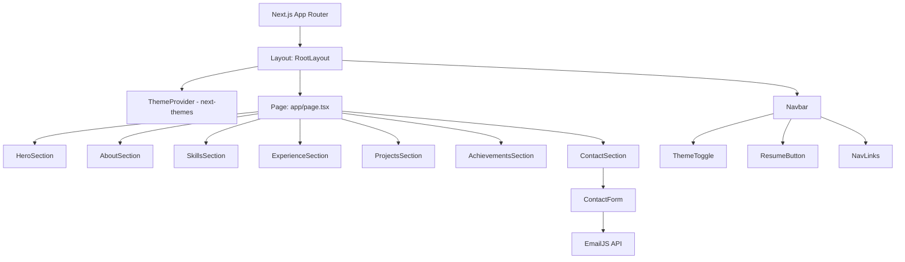

# Design Document: Developer Portfolio

## Overview

A single-page portfolio website for Sahil Vishwakarma built with Next.js 14 (App Router) and Tailwind CSS. The site is a static/SSG application with no backend — contact form submissions are handled via a third-party email service (EmailJS or Resend). The design follows an Apple/Linear/Vercel-inspired aesthetic with dark mode as default, smooth Framer Motion animations, and full SEO optimization.

Key technical decisions:
- **Next.js 14 App Router** — SSG for optimal Lighthouse scores, built-in `<head>` metadata API
- **Tailwind CSS** — utility-first, mobile-first responsive design
- **Framer Motion** — scroll-triggered animations, respects `prefers-reduced-motion`
- **next-themes** — dark/light mode with localStorage persistence
- **EmailJS** — client-side contact form submission without a backend
- **TypeScript** — type safety throughout

---

## Architecture



The entire portfolio is a single route (`/`). All sections are rendered server-side at build time (SSG). The only client-side interactivity is:
- Theme toggle (next-themes)
- Hamburger menu open/close
- Scroll-triggered animations (Framer Motion)
- Contact form submission (EmailJS)

---

## Components and Interfaces

### Layout Components

**`RootLayout`** (`app/layout.tsx`)
- Wraps the app with `ThemeProvider`
- Injects global SEO metadata via Next.js Metadata API
- Renders `Navbar` above `{children}`

**`Navbar`** (`components/Navbar.tsx`)
- Fixed/sticky, full-width
- Contains: logo/name, nav links, `ThemeToggle`, `ResumeButton`
- Glassmorphism background activates after scrolling past hero (via `useScrollY`)
- Collapses to hamburger on `< 768px`

**`ThemeToggle`** (`components/ThemeToggle.tsx`)
- Uses `useTheme` from `next-themes`
- Sun/moon icon swap with smooth transition

**`ResumeButton`** (`components/ResumeButton.tsx`)
- `<a href="/resume.pdf" download target="_blank">` pattern
- Visible at all breakpoints

### Section Components

Each section component is a `'use client'` component (for Framer Motion) that accepts no props — content is co-located as constants.

| Component | File |
|---|---|
| `HeroSection` | `components/sections/HeroSection.tsx` |
| `AboutSection` | `components/sections/AboutSection.tsx` |
| `SkillsSection` | `components/sections/SkillsSection.tsx` |
| `ExperienceSection` | `components/sections/ExperienceSection.tsx` |
| `ProjectsSection` | `components/sections/ProjectsSection.tsx` |
| `AchievementsSection` | `components/sections/AchievementsSection.tsx` |
| `ContactSection` | `components/sections/ContactSection.tsx` |

### Shared UI Components

**`ProjectCard`** (`components/ui/ProjectCard.tsx`)
```typescript
interface ProjectCardProps {
  title: string;
  description: string;
  techStack: string[];
  achievements: string[];
  githubUrl?: string;
  demoUrl?: string;
}
```

**`SkillBar`** (`components/ui/SkillBar.tsx`)
```typescript
interface SkillBarProps {
  name: string;
  level: number; // 0–100
  icon?: string; // optional icon name/url
}
```

**`ContactForm`** (`components/ui/ContactForm.tsx`)
```typescript
interface FormState {
  name: string;
  email: string;
  message: string;
}

interface FormErrors {
  name?: string;
  email?: string;
  message?: string;
}

type SubmitStatus = 'idle' | 'loading' | 'success' | 'error';
```

### Animation Utility

**`useScrollAnimation`** (`hooks/useScrollAnimation.ts`)
- Returns Framer Motion `ref` and `controls` for scroll-triggered animations
- Checks `window.matchMedia('(prefers-reduced-motion: reduce)')` and returns no-op variants if true

---

## Data Models

All content is static and co-located in a `data/` directory as typed TypeScript constants.

### `data/projects.ts`
```typescript
export interface Project {
  id: string;
  title: string;
  description: string;
  techStack: string[];
  achievements: string[];
  githubUrl?: string;
  demoUrl?: string;
}

export const projects: Project[] = [
  {
    id: 'automotive-crm',
    title: 'Automotive CRM Platform',
    description: 'Lead management system with 15+ APIs, React frontend, and .NET backend.',
    techStack: ['React', 'TypeScript', '.NET Core', 'SQL Server'],
    achievements: ['Built 15+ REST APIs', 'Reduced lead response time by 40%'],
  },
  {
    id: 'field-service-suite',
    title: 'Field Service Suite (FSS)',
    description: 'Dashboard for scheduling and reporting with real-time data sync and secure API integration.',
    techStack: ['React', 'TypeScript', 'ASP.NET Core', 'SQL Server'],
    achievements: ['Real-time data sync', 'Secure JWT-based API integration'],
  },
  {
    id: 'payables-approval-tracking',
    title: 'Payables Approval & Tracking (PAT)',
    description: 'Financial workflow system featuring backend modernization and SQL optimization.',
    techStack: ['.NET Core', 'SQL Server', 'React'],
    achievements: ['Backend modernization', 'SQL query optimization reducing load by 60%'],
  },
];
```

### `data/skills.ts`
```typescript
export interface Skill {
  name: string;
  level: number;
  icon?: string;
}

export interface SkillCategory {
  category: 'Frontend' | 'Backend' | 'Database' | 'Tools';
  skills: Skill[];
}
```

### `data/experience.ts`
```typescript
export interface ExperienceEntry {
  company: string;
  role: string;
  tenure: string;
  achievements: string[];
}
```

### `data/achievements.ts`
```typescript
export interface Achievement {
  title: string;
  description: string;
}
```

### Form Validation Rules
- `name`: required, non-empty after trim
- `email`: required, matches `/^[^\s@]+@[^\s@]+\.[^\s@]+$/`
- `message`: required, non-empty after trim

---

## Correctness Properties

*A property is a characteristic or behavior that should hold true across all valid executions of a system — essentially, a formal statement about what the system should do. Properties serve as the bridge between human-readable specifications and machine-verifiable correctness guarantees.*

### Property 1: Skills are grouped by category

*For any* skills data array, when rendered by the SkillsSection, every skill should appear under exactly one category heading that matches its assigned category, and no skill should appear under a different category.

**Validates: Requirements 4.1**

---

### Property 2: ProjectCard renders all required fields

*For any* `Project` data object, when rendered as a `ProjectCard`, the resulting output should contain the project title, description, at least one tech stack badge, and at least one achievement entry.

**Validates: Requirements 6.2**

---

### Property 3: ProjectCard shows action button if and only if URL is present

*For any* `Project` data object, when rendered as a `ProjectCard`, a GitHub or demo action button should be present in the output if and only if the corresponding URL field (`githubUrl` or `demoUrl`) is defined and non-empty.

**Validates: Requirements 6.6**

---

### Property 4: Achievement renders title and description

*For any* `Achievement` data object, when rendered in the AchievementsSection, the output should contain both the achievement's title and its description as non-empty strings.

**Validates: Requirements 7.2**

---

### Property 5: Contact form rejects invalid inputs

*For any* form submission where at least one required field (name, message) is empty after trimming, or the email field does not match a valid email pattern, the form should not submit and should display at least one inline validation error corresponding to each invalid field.

**Validates: Requirements 8.5, 8.6**

---

### Property 6: Theme preference round-trip

*For any* theme value (`'dark'` or `'light'`) set by the user via the ThemeToggle, the value should be persisted to localStorage, and on the next page load with that localStorage value present, the active theme should equal the stored value.

**Validates: Requirements 9.3, 9.4**

---

### Property 7: All images have non-empty alt text

*For any* image element rendered anywhere in the portfolio, the element should have an `alt` attribute that is a non-empty string.

**Validates: Requirements 11.6**

---

### Property 8: prefers-reduced-motion disables animations

*For any* animated component, when the `prefers-reduced-motion: reduce` media query is active, the component's animation variants should produce no visible motion (zero displacement, zero opacity change, or instant duration).

**Validates: Requirements 13.5**

---

## Error Handling

### Contact Form Errors
- **Empty fields**: Inline error message below each empty field on submit attempt; form does not call EmailJS.
- **Invalid email**: Inline error on the email field; form does not submit.
- **EmailJS failure**: Display a generic error banner ("Something went wrong. Please try again or email directly."); do not clear the form so the user can retry.
- **EmailJS success**: Display a success message and clear the form.

### Theme Persistence Errors
- If `localStorage` is unavailable (e.g., private browsing with storage blocked), fall back to the OS `prefers-color-scheme` media query, then default to dark mode. No error is surfaced to the user.

### Resume Download
- The `<a download>` attribute is used. If the browser does not support forced download (e.g., same-origin PDF in some browsers), `target="_blank"` ensures the file opens in a new tab as a fallback.

### Image Loading
- All images use `loading="lazy"` and include `width`/`height` attributes to prevent layout shift (CLS).
- Broken images fall back gracefully via `alt` text.

---

## Testing Strategy

### Dual Testing Approach

Both unit tests and property-based tests are required. They are complementary:
- **Unit tests** verify specific examples, static content, and integration points.
- **Property-based tests** verify universal rules across all valid inputs.

### Unit Tests (Vitest + React Testing Library)

Focus areas:
- Render each section component and assert required static content strings are present.
- Render `Navbar` and assert all nav links, `ThemeToggle`, and `ResumeButton` are present.
- Render `ContactForm` and assert all three fields are present.
- Submit `ContactForm` with valid data and assert success message appears.
- Submit `ContactForm` with empty fields and assert error messages appear.
- Click `ThemeToggle` and assert theme class changes on `<html>`.
- Assert `ResumeButton` has `download` attribute and `target="_blank"`.
- Assert all `` elements in rendered output have non-empty `alt` attributes.
- Assert SEO metadata (title, description, OG tags) is present in the document head.

### Property-Based Tests (fast-check + Vitest)

Each property test runs a minimum of **100 iterations**. Each test is tagged with a comment referencing the design property.

**Property 1 — Skills grouped by category**
```
// Feature: developer-portfolio, Property 1: Skills are grouped by category
// For any array of Skill objects with valid categories, rendering SkillsSection
// should place each skill under its correct category heading.
```
Generator: arbitrary arrays of `Skill` objects with category drawn from `['Frontend', 'Backend', 'Database', 'Tools']`.

**Property 2 — ProjectCard renders all required fields**
```
// Feature: developer-portfolio, Property 2: ProjectCard renders all required fields
```
Generator: arbitrary `Project` objects with non-empty title, description, techStack (≥1 item), achievements (≥1 item).

**Property 3 — ProjectCard action button iff URL present**
```
// Feature: developer-portfolio, Property 3: ProjectCard shows action button iff URL present
```
Generator: arbitrary `Project` objects with `githubUrl` and `demoUrl` independently set to `undefined` or a non-empty string.

**Property 4 — Achievement renders title and description**
```
// Feature: developer-portfolio, Property 4: Achievement renders title and description
```
Generator: arbitrary `Achievement` objects with non-empty title and description strings.

**Property 5 — Contact form rejects invalid inputs**
```
// Feature: developer-portfolio, Property 5: Contact form rejects invalid inputs
```
Generator: arbitrary `FormState` objects where at least one field is empty/whitespace-only or email is an invalid format string.

**Property 6 — Theme preference round-trip**
```
// Feature: developer-portfolio, Property 6: Theme preference round-trip
```
Generator: arbitrary theme value from `['dark', 'light']`. Set via toggle, read from localStorage, reload and assert active theme matches.

**Property 7 — All images have non-empty alt text**
```
// Feature: developer-portfolio, Property 7: All images have non-empty alt text
```
Generator: render each section component with arbitrary data; query all `img` elements and assert `alt` is non-empty.

**Property 8 — prefers-reduced-motion disables animations**
```
// Feature: developer-portfolio, Property 8: prefers-reduced-motion disables animations
```
Generator: mock `window.matchMedia` to return `matches: true` for `prefers-reduced-motion: reduce`; render animated components and assert motion variants have zero displacement or instant duration.

### PBT Library

Use **fast-check** (`npm install --save-dev fast-check`) with Vitest. Configure each `fc.assert` call with `{ numRuns: 100 }` minimum.

### Test File Structure

```
__tests__/
  unit/
    Navbar.test.tsx
    HeroSection.test.tsx
    AboutSection.test.tsx
    SkillsSection.test.tsx
    ExperienceSection.test.tsx
    ProjectsSection.test.tsx
    AchievementsSection.test.tsx
    ContactSection.test.tsx
    ContactForm.test.tsx
    ThemeToggle.test.tsx
    ResumeButton.test.tsx
    seo.test.tsx
  property/
    skills-grouping.property.test.tsx
    project-card.property.test.tsx
    achievement.property.test.tsx
    contact-form-validation.property.test.tsx
    theme-persistence.property.test.tsx
    image-alt.property.test.tsx
    reduced-motion.property.test.tsx
```
